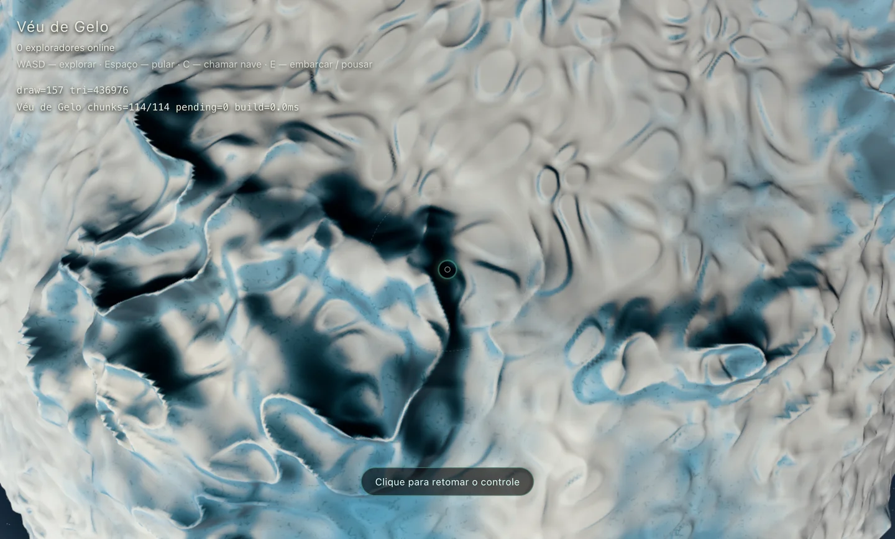
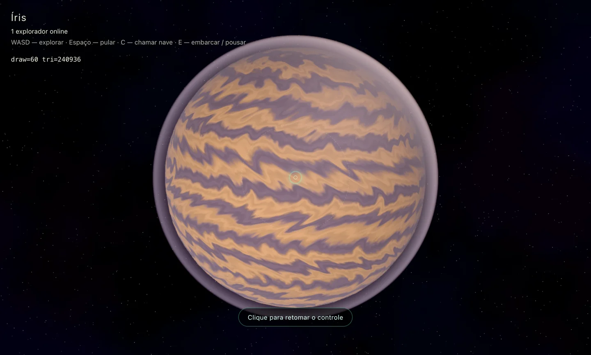

# Revisão de exploração — 9 de setembro de 2026

Correções aplicadas ao cliente e catálogo local, mantendo identidades e poses existentes.

- Avatar: projeção com `modelViewMatrix`, composta na CPU, evitando subtrair coordenadas astronômicas em float32 no shader após o skinning.
- Embarque/desembarque: eixo vertical relativo ao centro do planeta; ponto inicial da transição guardado no referencial local e reprojetado durante sua rotação/translação.
- Oceano orbital: teste de profundidade permanece ativo em todos os LODs. Antes, um oceano distante podia cobrir a nave e outros mundos.
- Brilho: limitado o domínio das potências fracionárias em terreno, atmosfera, nuvens, oceano e Sol. Arredondamento de produtos escalares acima de 1 podia gerar NaN e contaminar o bloom.
- Voo: até 12.000 m/s no espaço, mantendo a redução por altitude e as assistências de aproximação.
- Gelo: substituídas plataformas em grade por ruído simplex deformado, vales largos e fissuras sem ondas lineares.
- Gasoso: advecção longitudinal, variação por latitude e rotação do vórtice no shader; deformação limitada para não esticar indefinidamente em sessões longas.
- Catálogo: Âmbar (rochoso cobre), Cinza Serena (rochoso sem atmosfera) e Aurora (gelo lilás). Seis planetas; plano distante da câmera ampliado para abranger o sistema.

## Verificação

Build do cliente, TypeScript do servidor e ESLint dos arquivos alterados passaram. O aviso de tamanho do bundle continua existente.

Testes no navegador: seis orientações de embarque, velocidade efetiva de 12 km/s após aceleração, continuidade do relevo em 1.000 direções, referencial inercial de voo, dois clientes sincronizando seis perfis e dez regressões de profundidade das nuvens/streaming. Comparação de dois renders separados por 20 segundos de tempo do shader confirmou movimento nas faixas gasosas.

Varredura dos seis mundos em 72 vistas: nenhum quadro inteiramente preto, nenhum componente não finito no buffer HDR e nenhum erro de compilação dos shaders. É uma varredura limitada, sem reproduzir exatamente o flash intermitente reportado; não prova a ausência de todo flash em exploração prolongada. A correção de precisão do avatar foi revisada no shader; o sintoma subjetivo de flicker ainda merece observação durante o jogo.

Resultados em [results.json](results.json). Para repetir os testes: importar `/scripts/gameplay-checks.js`, `/scripts/exploration-checks.js`; as regressões visuais usam `/scripts/visual-checks.js` com o contexto do editor. As capturas usam câmera de diagnóstico, por isso o HUD não representa uma sessão normal.

## Gelo a média distância

## Gasoso

