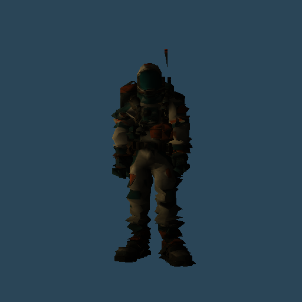
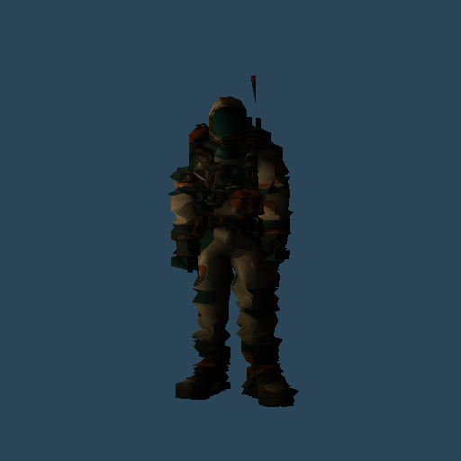
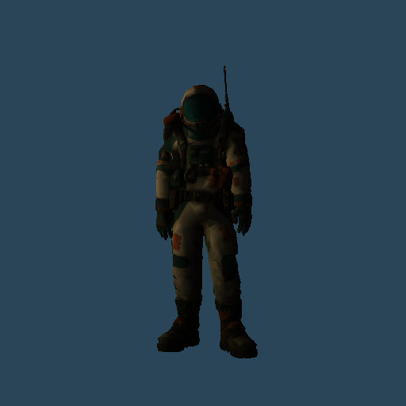
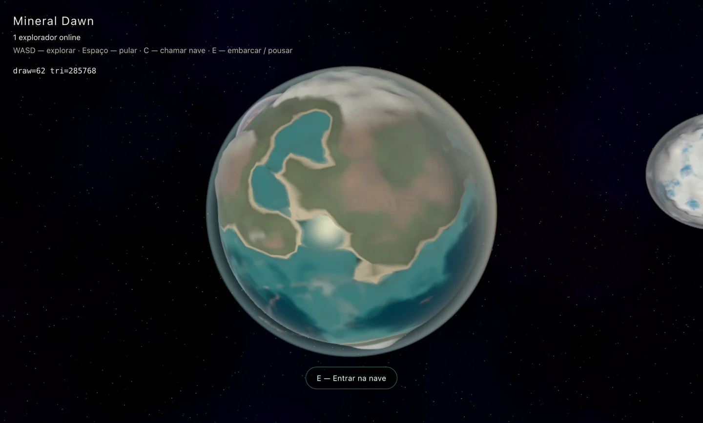

# Precisão do cenário e oceano orbital

O defeito foi reproduzido com a animação congelada: câmera e personagem transladados juntos 3,1 cm em cada eixo, mantendo exatamente o mesmo enquadramento. A 360 km da origem, a transformação de ossos padrão passava pela textura float32 em coordenadas mundiais antes de aplicar a matriz inversa de bind. Isso deformava triângulos, mesmo depois da correção anterior da projeção do avatar.

A nova paleta de ossos contém o produto completo de bind, osso e inversa já em coordenadas locais da malha. A composição ocorre em precisão dupla na CPU. Cada mesh possui sua própria paleta, preservando binds diferentes mesmo quando compartilham ossos. Animação e skinning continuam na GPU; poses físicas e de rede não mudaram.

Terreno, grama, props, folhagem, água e nuvens também passaram a projetar com modelViewMatrix, evitando o deslocamento orbital intermediário em float32. A iluminação mantém as referências mundiais. O buffer logarítmico continua ativo.

## Duas capturas do mesmo enquadramento

Antes: 9.015 pixels com diferença RGB acumulada maior que 6/255; erro médio por canal 0,626/255.




Depois: as imagens do personagem são idênticas pixel a pixel.




No cenário completo, a comparação controlada entre o shader antigo e o novo reduziu os pixels acima da mesma tolerância de 8.350 para zero. Pequenas diferenças restantes de iluminação ficaram abaixo da tolerância (ver erro médio em results.json).

## Água no LOD distante

A esfera de fallback antiga não tinha deslocamento de altura: ficava no raio-base de 25.000 m, acima do oceano de 24.912,25 m. Faces da esfera grosseira penetravam alternadamente a água, criando as bolinhas quando o depth test foi ativado.

O fallback agora recebe altura real, incluindo o fundo do mar, normais recalculadas e resolução de 64×48 segmentos (antes 32×32). O teste de profundidade da água permanece ativo para respeitar naves e outros planetas.



## Validação

Build do cliente, ESLint dos arquivos alterados, duas regressões de precisão e dez regressões de streaming/oclusão passaram. Nenhum erro de shader. O aviso já existente sobre tamanho do bundle permanece.

No navegador do jogo principal, com terreno próximo e assets carregados:

```js
await (await import('/scripts/jitter-checks.js')).runJitterChecks()
```

Resultados completos: [results.json](results.json). Movimento intencional de idle, vento e rotação não é congelado no jogo; foi congelado apenas nas comparações de precisão.

## Microrelevo próximo e distribuição orbital

A etapa de bump mapping ainda diferenciava `vWorldPos`: diferenças entre pixels de posições astronômicas quantizavam o gradiente, fazendo o grão parecer animado. Agora ela diferencia posições em espaço da câmera e gira apenas os vetores resultantes para o referencial da iluminação. O ruído e sua intensidade foram preservados.

Teste isolado com o shader real de terreno, textura/luz congeladas e translação conjunta de câmera/patch de 9 mm por eixo: 685 pixels acima da tolerância antes, zero depois; erro médio por canal caiu de 0,1602 para 0,000412 em escala 0–255. Repetir com `/scripts/terrain-detail-checks.js`, função `checkTerrainDetailTranslation()`.

As fases orbitais iniciais dos seis planetas foram distribuídas em torno da estrela (aproximadamente a cada 60 graus), mantendo raios, velocidades, identidades e época do mundo. Publicação local sem exclusão de dados. Coordenadas verificadas em ambos os lados da estrela, registradas em [terrain-detail-results.json](terrain-detail-results.json).
