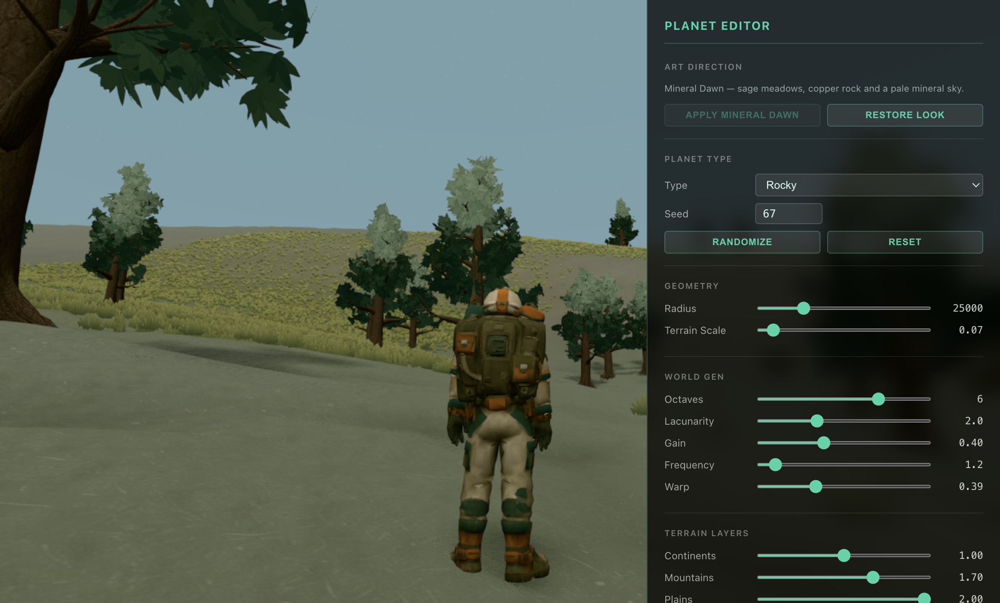

# Relevo e distribuição — segunda revisão

## Direção aplicada

1. Preencher o espaço entre continentes e microdetalhe com planaltos, escarpas arredondadas e vales. Manter as grandes massas continentais e as configurações existentes como base.
2. Organizar árvores em bosques e clareiras, com tamanho menor nas bordas. Concentrar rochas em áreas expostas e diminuir a grama nesses afloramentos e sob bosques.
3. Preservar instancing e limites de instâncias, validar fronteiras da malha e medir geração em CPU antes de avaliar o resultado visual.

## Implementação

`samplePlanetLandformHeight` acrescenta três campos contínuos em coordenadas do planeta, nas escalas de 780, 1150 e 2400 metros. Uma transição estreita define os platôs; outro campo recorta os vales. A contribuição é atenuada nas bacias continentais e modulada pelos cinturões de montanhas. O controle existente **Relief Variety** também controla essa camada. Planetas de gelo e gasosos mantêm o resultado anterior.

A camada vive no gerador compartilhado por cliente e servidor, utilizado pela geometria, consultas de altura e física. Não foi necessário acrescentar passes de renderização ou texturas. O ruído novo usa interpolação quintic contínua, sem simulação de erosão por vértice. A forma continental anterior não foi substituída; sua costa pode mudar localmente com o relevo.

`surface-ecology.ts` fornece umidade regional, cobertura de bosque, exposição de encosta e afloramentos para árvores, pedras e grama. Substitui a máscara dos props que antes tinha um valor constante por cubo de 110/190 m. A seleção de espécies varia regionalmente. Árvores têm separação mínima de 6 m dentro de cada chunk, e rochas de 2,5 m. Há mais pedras pequenas e algumas maiores em afloramentos.

A distribuição usa um orçamento fixo de candidatos, em vez de continuar tentando preencher a quota em habitats pobres. Os limites existentes permanecem: 34 árvores, 48 rochas e 2400 instâncias de grama por camada/chunk. A densidade do editor continua funcionando.

## Validação reproduzível

```sh
node client/scripts/terrain-checks.mjs --benchmark
pnpm --dir client build
pnpm --dir server/spacetimedb exec tsc --noEmit
```

No console do editor:

```js
await (await import('/scripts/landscape-checks.js')).runLandscapeChecks()
await (await import('/scripts/visual-checks.js')).runVisualChecks()
```

- 12 mil amostras, quatro seeds: alturas finitas e determinísticas. Camada local entre -61,9 e +65,1 m, antes da atenuação continental. Continuidade da camada nova verificada com deslocamentos submilimétricos.
- Campos ecológicos contínuos nas fronteiras das células e resposta coerente à inclinação.
- Teste de duas faces adjacentes: erro zero nas posições e normais da borda. Normais unitárias e voltadas para fora.
- 50 áreas sintéticas de vegetação: 156 árvores, 23 áreas sem árvores, menor separação de 6,25 m. Verificação de determinismo, limites da grama e exclusão sob a água.
- Mediana de cinco gerações de chunk 33×33: 180,3 ms na revisão `3aa5ba9`, 181,0 ms nesta revisão. É uma medida isolada de CPU na máquina de desenvolvimento; não representa FPS nem garante igualdade de custo em todos os biomas.

## Limites conhecidos

Na revisão original, candidatos semeados por chunk ainda mudavam com o LOD. Essa limitação foi corrigida posteriormente com [herança de props e preparação incremental](../prop-lod-review/README.md). A separação mínima entre props novas de chunks vizinhos continua sendo uma limitação.

Não há cavernas, saliências suspensas nem erosão hidráulica simulada. A superfície continua sendo um campo de altura radial. O ruído continental antigo permanece; os testes de continuidade estrita se referem à camada nova.

O módulo de servidor não foi publicado. Para multiplayer, cliente e servidor precisam usar a mesma revisão do gerador. Não foi executado nenhum comando que apague ou publique o banco.

## Inspeção no editor

Material rochoso passa a aparecer gradualmente entre aproximadamente 19° e 43° de inclinação. A estratificação mineral é discreta e filtrada pela resolução em tela, com os mesmos critérios nos materiais próximos, distantes e de fallback.

Ponto usado para inspecionar a escarpa no seed 67, com as configurações de relevo do editor desta revisão. Aplicar **Mineral Dawn** para a paleta das capturas. O trecho abaixo apenas posiciona o jogador no editor de desenvolvimento:

```js
const { walker, engine } = window.__nmsEditorDebug
const Vector3 = engine.camera.position.constructor
walker.enableAt(walker.targets[0], new Vector3(-0.121553467091, 0.376804080125, 0.918282875719), Math.PI / 2)
walker.state.pitch = 0.42
```

Após o carregamento neste ponto: 417 chunks visíveis, nenhuma geração pendente e nenhum erro de compilação de shader. Os testes de geometria/distribuição e os dez testes de oclusão/streaming passaram no navegador. O teste de esfera de nuvem agora define explicitamente `FrontSide` no cenário orbital, pois a câmera de superfície muda o material original para `BackSide`.

Na caminhada de verificação de 31,4 m, o ponto de referência do jogador manteve 1,64 m de distância radial ao solo (altura dos olhos mais folga), permanecendo grounded. Na seção da escarpa entre x=-2920 e x=-2820 do levantamento local, a altura total passa de 137,3 para 198,3 m acima do raio-base; a camada nova responde por aproximadamente 39 m dessa diferença, já considerando a atenuação regional.


