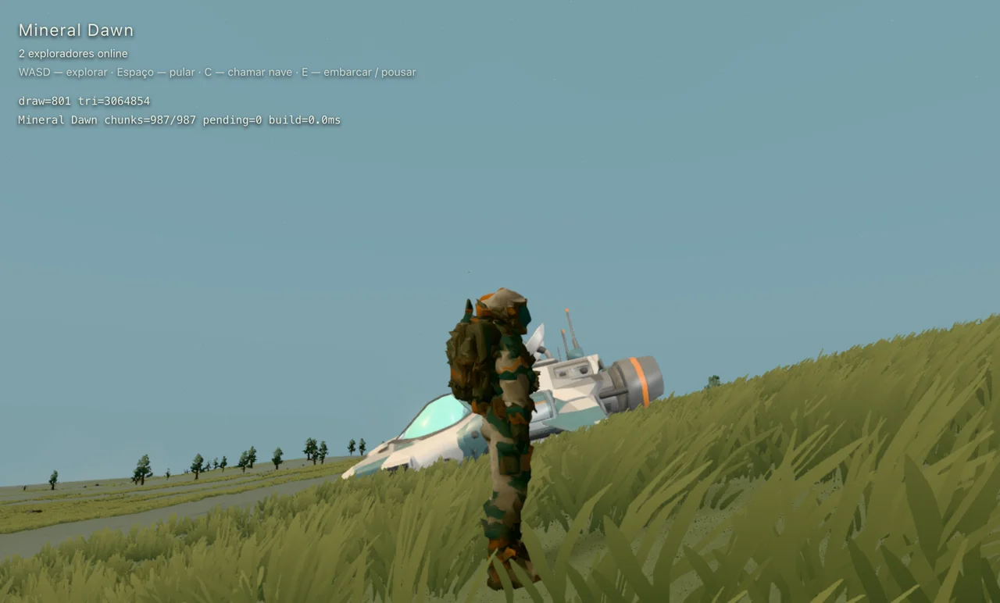
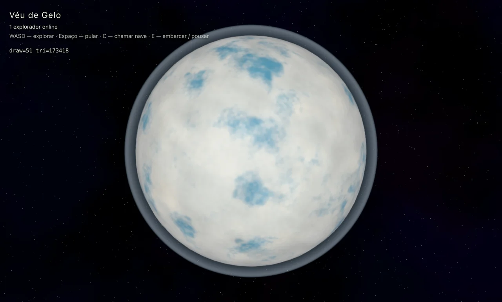
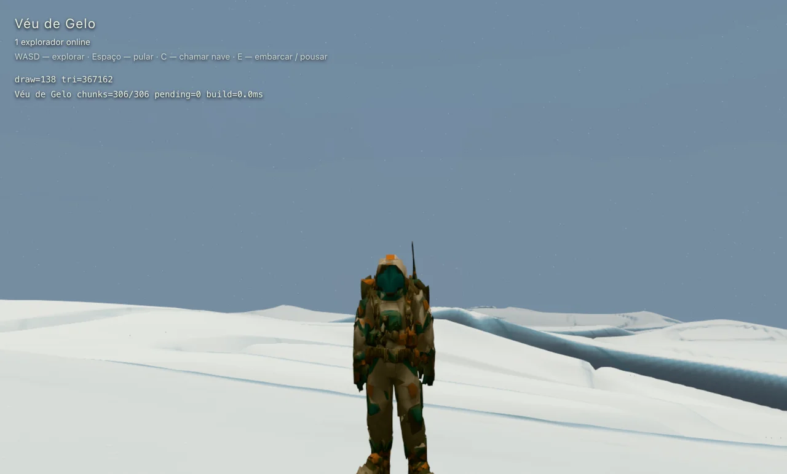
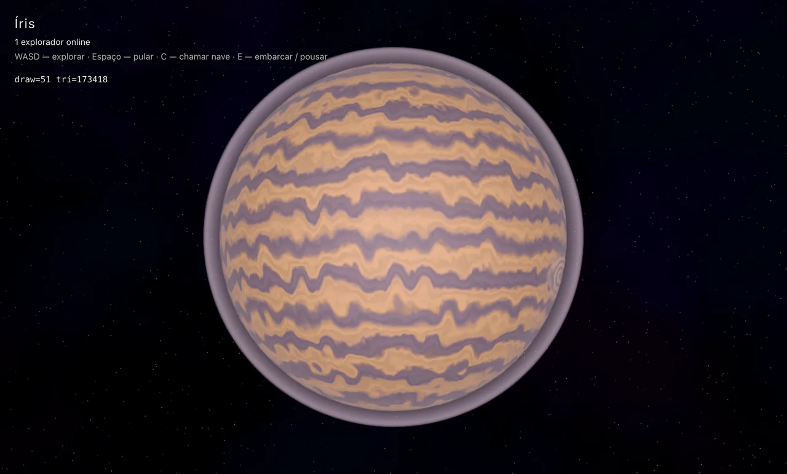

# Exploração multiplayer local

SpacetimeDB 2.1.0, SDK 2.1.0, Vite e WebGL reais. O banco local foi publicado e atualizado sem apagar dados, e o processo foi reiniciado durante uma sessão.

## Resultado

- Duas conexões independentes: caminhada e nave replicadas, f64 preservado, posse vinculada ao remetente e presença encerrada ao desconectar.
- Dois clientes completos: avatar e nave remotos carregados; uma caminhada de 7,75 m chegou ao outro cliente. Em voo, o avatar ficou oculto e a nave usou o referencial espacial.
- Reinício do servidor: reconexão automática, identidade, época do mundo e catálogo preservados; a cena continuou disponível durante a queda.
- Recarregamento em voo: mesmo jogador e pose, erro de posição inferior a 0,000001 m; retorno com velocidade zero.
- Rotação/translação: teste de 600 transformações de planeta mantendo a nave espacial estacionária; também avançado o relógio do jogo real em 60 s, com erro de posição inferior a 0,000001 m e nenhuma alteração de orientação.
- Gasoso: limite profundo respeitado; nenhuma geração de chunks de terreno.
- Gelo: amostra de 1.000 direções, relevo entre −283 m e +1.257 m sobre o raio de referência, sem descontinuidade no teste de perturbação.
- Regressões: oclusão de nuvens/água, bordas de faces, habitats e herança de props entre LODs passaram na cena principal, usando o renderer de Mineral Dawn.
- Build do cliente, build/publicação do servidor, TypeScript e lint dos módulos alterados passaram. Permanece o aviso do Vite sobre tamanho do bundle.

Os resultados detalhados estão em [results.json](results.json). Os testes de renderização anteriores foram executados com o objeto de debug do editor apontando temporariamente para o planeta da cena multiplayer. Não foi feito um benchmark de FPS: abas em segundo plano e instrumentação distorcem esse número.

## Capturas

Mineral Dawn na cena principal, durante a sessão de dois clientes:

Véu de Gelo, em órbita e na superfície:

Íris, gigante gasoso. O vórtice é localizado e pode estar no hemisfério oposto nesta fase da rotação:

## Escopo atual

Movimento arcade no cliente, sincronização a 10 Hz e interpolação remota. A corotação próxima ao chão é uma assistência de gameplay; no espaço, o jogador pode parar e observar o planeta girar. Não há integração de gravitação newtoniana ou validação de trajetórias no servidor.

O catálogo compilado mantém o editor e o multiplayer alinhados. Sliders experimentais não publicam alterações por conta própria. A base atende sessões pequenas; não há ainda assinatura das poses por proximidade. Chunks e props mantêm os limites e mecanismos da revisão anterior; detalhes adicionais aparecem com a aproximação.
